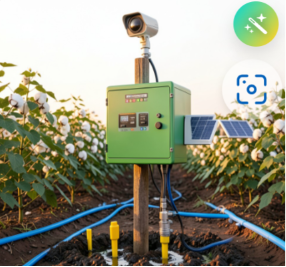
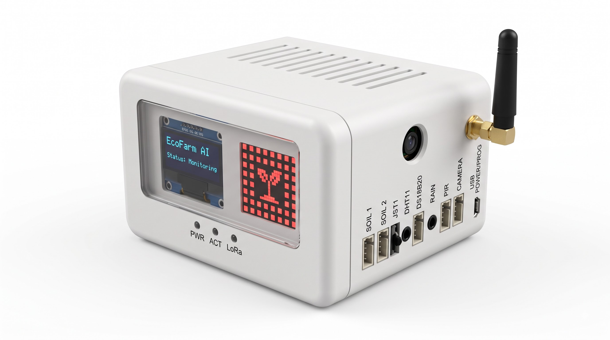

# EcoFarm-AI — Product CAD Files

CAD renderings and prototype design files for the **EcoFarm AI** smart farming device — an Arduino UNO Q based edge-AI system for precision irrigation and crop disease detection.

---

## 📐 CAD Renderings

### Actual CAD

### CAD

### CAD Rendering of EcoFarm Device

### EcoFarm AI View CAD

### Prototype Project CAD

---

## 📁 About

This repository contains the CAD design files and rendered previews of the EcoFarm AI device enclosure and prototype.
